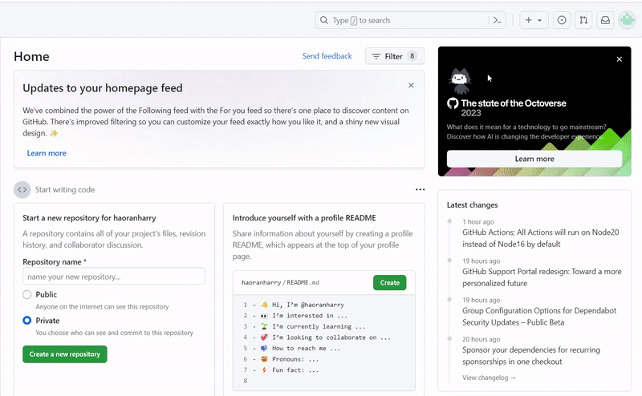

# Resume Hosting and Formatting Guide

## Purpose

This README is a comprehensive guide for hosting and formatting your resume using Markdown and popular hosting platforms like GitHub Pages. It aims to provide practical steps while relating them to the key principles of technical communication, as outlined in Andrew Etter's book "Modern Technical Writing." In this guide, we will explore the practical process of leveraging Markdown, Markdown editors, and platforms like GitHub Pages and Jekyll to present resumes effectively.

## Prerequisites

1. Resume
   - Having a well-written and up-to-date resume.
2. Familiarity with Markdown
   - Markdown is a simple yet powerful markup language used for formatting text. Acquiring knowledge about Markdown is essential for effectively utilizing it to format your resume. Familiarity with Markdown syntax allows you to structure your resume content efficiently, enhancing readability and presentation. To aid in your understanding of Markdown or to provide guidance for beginners, I have included some Markdown resources in the "[More Resources](#more-resources)" section.
3. GitHub Account
   - Hosting a resume on GitHub requires a GitHub account. If you don't have one, sign up for a free account on [GitHub's website](https://github.com/). Having a GitHub account allows you to create repositories, upload files, and showcase your projects, including your resume.
4. Prepared Resume
   - Before proceeding, ensure you have your resume prepared in Markdown style.

## Instructions

### **Why use a lightweight markup language?**

Using a lightweight markup language, such as Markdown or reStructuredText, offers several advantages in technical communication. As stated in Etter's book, these languages are designed to simplify the writing process. They are simple and easy to learn and use, allowing writers to focus more on content rather than complex formatting. Moreover, lightweight markup languages such as Markdown can be translated into HTML.; therefore, documents created with Markdown can be easily published online, reaching a wider audience. Lastly, the barriers to entry for lightweight markup languages are low, as writers do not need expensive specialist editors or extensive technical knowledge to participate.

### **Share/host resume on a distributed version control system**

Sharing or hosting a resume on a distributed version control system (DVCS) aligns with principles outlined in Andrew Etter's "Modern Technical Writing":

1. **Version Control**: DVCS like Git allows for tracking changes, ensuring the resume reflects the latest information.
2. **Collaboration**: Enables feedback and refinement from peers, leading to stronger resumes.
3. **Accessibility and Distribution**: Makes the resume easily accessible to potential employers and recruiters.
4. **Documentation as Code**: Treats the resume as a dynamic document undergoing continuous improvement, akin to software code.

#### **How to share/host resume on GitHub? (Step-by-Step Guide)**

1. Create a new repository
   - Log in to your GitHub account.
   - Click on the `+` sign in the upper-right corner, then select `New repository`.
   - Name your repository "username.`github.io`", replace the "username" with your actual GitHub username.
   - Choose the `public` visibility
   - Optionally, add a README file by selecting the `Add a README file` checkbox.
     - Including a README file in the resume repository is recommended because it's where you would include some documentation about your repository. For example, you might provide a brief overview of the resume's contents, or if you want feedback, you might include guidance on how others can give feedback on your resume. It serves as a quick guide for anyone accessing the repository.
   - Click `Create repository` to create the repository. <br />
     
2. Upload resume
   - Go to your newly created repository.
   - Rename your resume in Markdown style to `index.md`.
   - Click on the `Add file` button, then select `Upload files`.
   - Drag and drop the `index.md` into the designated area or click on `choose your files` to select it manually.
   - Add a commit message describing the upload (e.g., "Added resume").
   - Finally, click `Commit changes`. <br />
     
3. Access your resume
   - Your can access your resume at `https://`username`.github.io/`
     

### **Format resume with a static site generator**

In "Modern Technical Writing," Andrew Etter highlights how static site generators such as Jekyll or Hugo make technical documentation easier. They convert Markdown content into static websites, offering flexibility in designing and customizing layout. GitHub automatically builds websites using Jekyll when you host them on GitHub Pages. This means that once you push your Markdown files to your GitHub repository, GitHub takes care of the rest. It runs Jekyll behind the scenes to convert your Markdown content into a static website, making it accessible to viewers online.

#### **Configure Jekyll Theme on GitHub (Step-by-Step Guide)**

GitHub has some built-in Jekyll themes that you can use for your static websites. To utilize them, creating a `_config.yml` file in your repository. In this file, specify your preferred theme by adding "`theme: jekyll-theme-`yourTheme". Replace "yourTheme" with the name of your desired theme. You can find more about Jekyll in the "[More Resources](#more-resources)" section. In this guide, I am going to use the theme [architect](https://github.com/pages-themes/architect).

1. Go to your repository.
2. Click on the `Add file` button, then select `Create new file`.
3. Name the File and Add Content:
   - In the text field for the file name, type `_config.yml`.
   - In the content area, add the following lines:
   ```
   title: your title
   description: your desciption
   theme: jekyll-theme-architect
   ```
4. Click on the `Commit Changes...` button.
5. Optionally, you can change the commit message if you like. Additionally, you can add a description to provide more context about the changes.
6. Finally, click `Commit changes`. <br />
   

### **Final Resume Website Appearance**


## More Resources

Markdown

- [Markdown Overview](https://www.markdownguide.org/getting-started/)
- [Markdown Syntax](https://www.markdownguide.org/extended-syntax/#strikethrough)
- [Markdown Tutorial](https://www.markdowntutorial.com/)

Andrew Etter's book

- [Modern Technical Writing: An Introduction to Software Documentation](https://www.amazon.ca/Modern-Technical-Writing-Introduction-Documentation-ebook/dp/B01A2QL9SS)

Jekyll

- [Supported Themes on GitHub Pages](https://pages.github.com/themes/)
- [Jekyll Documentation](https://jekyllrb.com/docs/)

## Authors and Acknowledgements

**Author**: Harry Pu <br />

**Acknowledgements**: Special thanks to my COMP3040 class group members for providing feedback, allowing me to refine and complete this documentation.

## FAQs

**Why is Markdown better than a word processor?**

- **Simplicity**: Markdown offers a lightweight syntax that is simple to learn and use. It focuses on the content rather than complex formatting options, making it easier for writers to convey technical information clearly.
- **Version Control Compatibility**: Markdown files can be effectively managed using version control systems like Git. This approach aligns with the distributed version control system (DVCS) advocated by Etter in his book. By using Markdown, individuals can collaborate effectively, track changes, and manage revisions seamlessly within a version control environment.
- **Portability and Platform Independence**: Markdown documents are platform-independent and can be rendered into HTML, PDF, or other formats using static site generators. This makes Markdown ideal for creating documentation that can be accessed across various devices and platforms without compatibility issues.

**Why is my resume not showing up?**

- Ensure that your resume is named `index.md`.
- When you upload the resume, it might take some time for GitHub to build the static website.
